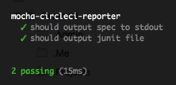
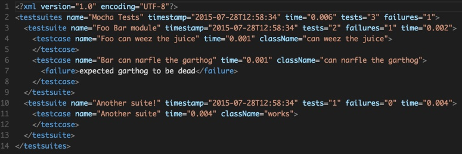

# mocha-circleci-reporter [](https://travis-ci.org/sandcastle/mocha-circleci-reporter)

> A Mocha reporter specifically for [Circle CI](https://circleci.com/).


## Getting Started

Install the reporter as a development dependency:

```sh
npm install mocha --save-dev
npm install mocha-circleci-reporter --save-dev
```

Update your `package.json` to use the reporter when running Mocha: 

```json
{
  "name": "my-package",
  "version": "0.0.1",
  "scripts": {
    "test": "node_modules/.bin/mocha --reporter mocha-circleci-reporter test/*.js"
  }
}
```

[mocha-junit-reporter](https://github.com/michaelleeallen/mocha-junit-reporter#usage) will output
results to `test-results.xml` by default. CircleCI needs the results in the `$CIRCLE_TEST_REPORTS` directory.

Either update your `circle.yml` to copy over the `test-results.xml:

```yaml
test:
  override:
    - npm run test
    - if [[ -e test-results.xml ]]; then cp test-results.xml $CIRCLE_TEST_REPORTS/test-results.xml; fi
```

or set the `$MOCHA_FILE`:

```yaml
machine:
  environment:
      MOCHA_FILE: "$CIRCLE_TEST_REPORTS/test-results.xml"
```

## Background

### Why another reporter?

As of Mocha 2.x, its not possible to use multple reporters out of the box.
This complicates things when dealing with CI systems like Circle CI that 
require a format such as [jUnit XML](https://windyroad.com.au/dl/Open%20Source/JUnit.xsd)
as a lot of the goodness that is written to console when running the default
reporter (`Spec`). 

To overcome this, we combine the output of both the 
builtin `Spec` and `mocha-junit-report` reporters.

Example spec output:



Example jUnit output:




### Mocha 3.x

There is work underway in Mocha 3.x to move to a plugin architecture that would
make multiple reporters dead simple, until then I hope this simplifies things.

https://github.com/mochajs/mocha/issues/1457

